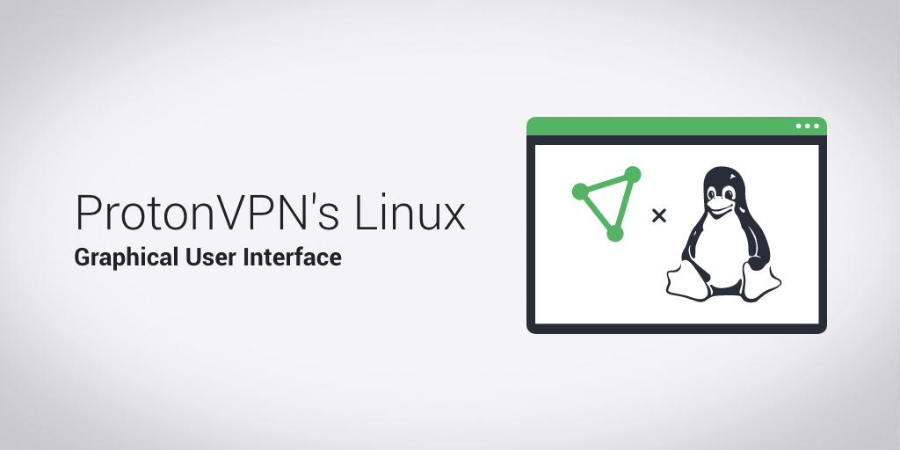
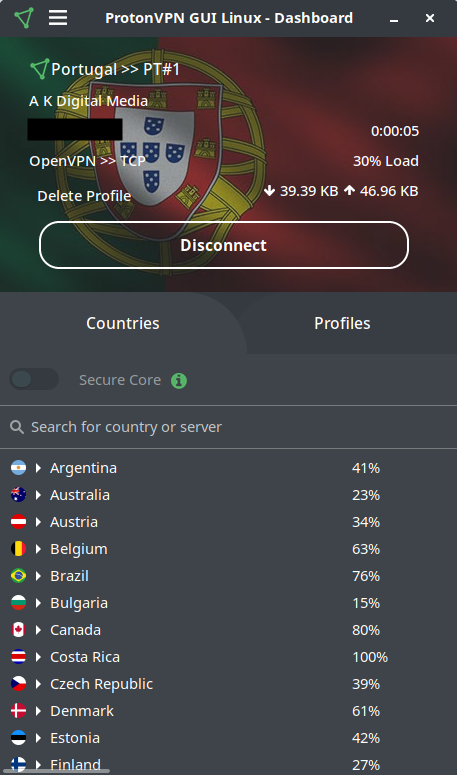
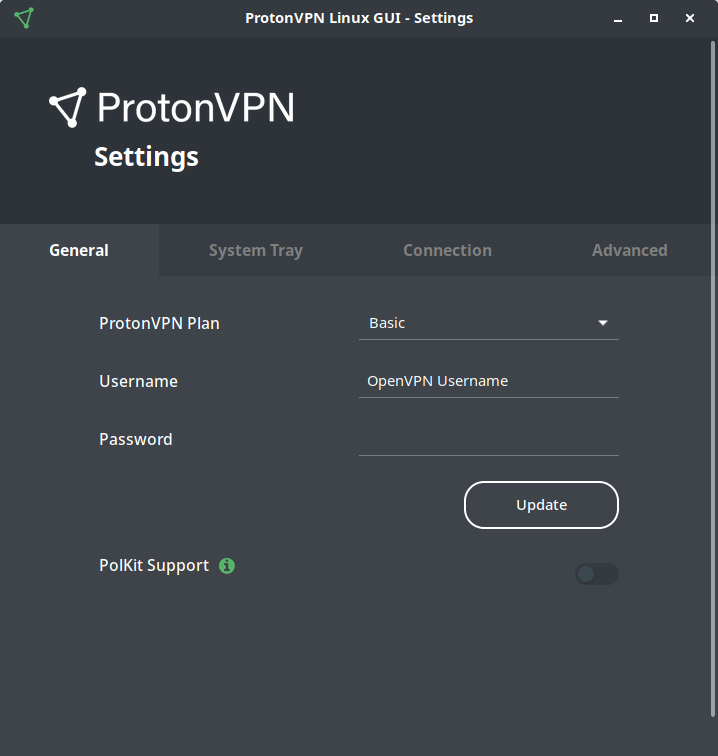

<h1 align="center">ProtonVPN Linux Application</h1>
<p align="center">
  </img>
</p>

<p align="center">
    <a href="https://twitter.com/ProtonVPN">
        
    </a>
    <a href="https://www.reddit.com/r/ProtonVPN">
        
    </a>
</p>

<p align="center">
  <a href="https://github.com/ProtonVPN/protonvpn-app/releases/latest">
      
  </a>
  <a href="https://pepy.tech/project/protonvpn-app">
    
  </a>   
    <a href="https://pepy.tech/project/protonvpn-app/week">
      
    </a>
</p>
<p align="center">
  
</p>
<p align="center">
    <a href="https://actions-badge.atrox.dev/ProtonVPN/protonvpn-app/goto?ref=master">
        
    </a>
</p>
<p align="center">
  <a href="https://github.com/ProtonVPN/linux-app/blob/master/LICENSE">
    </img>
  </a>
</p>


<h3 align="center">Linux app for ProtonVPN, written in Python. Layout designed in Glade.</h3>
<h3 align="center">Development Status: <u>Beta</u></h3>

This application works on top of <a href="https://github.com/ProtonVPN/linux-cli"><b>linux-cli</b></a>, making it a dependency. All local configurations are managed by the app (such as updating protocol, split tunneling, manage killswitch) while the connections are managed by the CLI. This way, you will be able to use the latest version of the CLI, while also being able to use the app.

**Disclaimer:**
The ProtonVPN application is currently still an <u>experimental interface</u>. It requires escalated privileges and might be somehow unstable. In the near future we plan to refactor both the ProtonVPN CLI and the app, so that the part of the client that really requires being executed as root user is kept to a minimum.

## Table of Contents
- [Installing and Updating](#installing-and-updating)
  - [Dependencies](#dependencies)
    - [Python dependencies](#python-dependencies)
    - [ProtonVPN App dependencies](#protonvpn-app-dependencies)
    - [ProtonVPN Tray dependencies](#protonvpn-tray-dependencies)
      - [Known Issues](#tray-known-issues)
        - [dbus-launch](#dbus-launch)
  - [Installing ProtonVPN App](#installing-protonvpn-app)
    - [Distribution based](#distribution-based)
    - [PIP based](#pip-based)
      - [How to Update](#to-update-to-a-new-version) 
  - [Uninstalling ProtonVPN App](#uninstalling-protonvpn-app)
  - [Manual installation](#manual-installation)
  - [Virtual environment](#virtual-environment)
- [How to use](#how-to-use)
   - [ProtonVPN App](#protonvpn-app)
   - [ProtonVPN Tray](#protonvpn-tray)
- [Enhancements](#enhancements)
  - [Create .desktop file](#create-desktop-file)
    - [ProtonVPN App](#protonvpn-app-1)
    - [ProtonVPN Tray](#protonvpn-tray-1)
  - [Sudo/PolKit](#sudopolkit)
- [App Layout](#app-layout)

# Installing and Updating

### Dependencies

#### Python dependencies
- python >= 3.5
- <a href="https://github.com/ProtonVPN/linux-cli"><b>linux-cli</b></a> >= 2.2.2
- requests >= 2.23.0
- configparse >= 4.0.2
- pip for python3 (pip3)
- setuptools for python3 (python3-setuptools)

#### ProtonVPN App dependencies

| **Distro**                              | **Command**                                                                                                     |
|:----------------------------------------|:----------------------------------------------------------------------------------------------------------------|
|Fedora/CentOS/RHEL                       | `sudo dnf install -y python3-gobject gtk3`                                                                      |
|Ubuntu/Linux Mint/Debian and derivatives | `sudo apt install -y python3-gi python3-gi-cairo gir1.2-gtk-3.0`                                                |
|OpenSUSE/SLES                            | `sudo zypper install python3-gobject python3-gobject-Gdk typelib-1_0-Gtk-3_0 libgtk-3-0`                        |
|Arch Linux/Manjaro                       | `sudo pacman -S python-gobject gtk3`                                                                            |

#### ProtonVPN Tray dependencies

| **Distro**                              | **Command**                                                                                                     |
|:----------------------------------------|:----------------------------------------------------------------------------------------------------------------|
|Fedora/CentOS/RHEL                       | `sudo dnf install -y libappindicator-gtk3 libnotify`                                                                      |
|Ubuntu/Linux Mint/Debian and derivatives | `sudo apt install -y gir1.2-appindicator3 libnotify-bin`                                                                       |
|OpenSUSE/SLES                            | `sudo zypper install libappindicator-gtk3 libnotify`                                                                      |
|Arch Linux/Manjaro                       | `sudo pacman -S libappindicator-gtk3 libnotify`                                                                           |

**NOTE:**
Gnome users will need to install an additional extension for this to work: <a href="https://extensions.gnome.org/extension/615/appindicator-support/"> KStatusNotifierItem/AppIndicator Support</a>

### Tray Known issues:
#### dbus-launch
There is a known issue when user attempts to start the systray/appindicator. This might throw an error that is similar to this one: `(<app-name>:<pid>) LIBDBUSMENU-GLIB-WARNING **: Unable to get session bus: Failed to execute child process "dbus-launch" (No such file or directory)` if a user does not have a specific package installed. If you are unable to use the systray/appindicator and have a similar error, then a solution is provided below.

**Solution:**
Install `dbus-x11` package for your distribution, more information can be found on this <a href="https://askubuntu.com/questions/1005623/libdbusmenu-glib-warning-unable-to-get-session-bus-failed-to-execute-child">stackoverflow</a> post.

#### PolKit
If you would like to use `pkexec` instead of the terminal (or alter `visudo`), then you will also need to install the following packages (unsure ? [Look here](#sudopolkit)):

| **Distro**                              | **Command**                                                                                                     |
|:----------------------------------------|:----------------------------------------------------------------------------------------------------------------|
|Fedora/CentOS/RHEL                       | `sudo dnf install -y polkit`                                                                                    |
|Ubuntu/Linux Mint/Debian and derivatives | `sudo apt install -y libpolkit-agent-1-0`                                                                       |
|OpenSUSE/SLES                            | `sudo zypper install polkit`                                                                                    |
|Arch Linux/Manjaro                       | `sudo pacman -S polkit`                                                                                         |

## Installing ProtonVPN App

### Distribution based
- Fedora/CentOS/RHEL: To-do
- Ubuntu derivatives: To-do
- OpenSUSE/SLES: To-do
- Arch Linux/Manjaro: <a href="https://aur.archlinux.org/packages/protonvpn-linux-gui/" target="_blank">Available at AUR</a>


### PIP based

*Note: Make sure to run pip with sudo*

`sudo pip3 install protonvpn-app`

#### To update to a new version

`sudo pip3 install protonvpn-app --upgrade`

### Manual Installation

**Note:** Before installing the app, make sure that you have previously installed the CLI, otherwise an error will be thrown.

1. Clone this repository

    `git clone https://github.com/ProtonVPN/linux-app`

2. Step into the directory

   `cd linux-app`

3. Install

    `sudo pip3 install -e .`

## Uninstalling ProtonVPN App

If you have installed the app via PIP or by cloning this repo, then to uninstall it type in the following command:

  `sudo pip3 uninstall protonvpn-app`

### Virtual environment

If you would like to run the app within a virtual environment (for either development purposes or other), then you can easily do that with the help of <a href="https://pipenv.readthedocs.io/en/latest/">pipenv</a>. Make sure to install pipenv and additional packages before.
**Note:** PolKit does not work within virtual environments.

| **Distro**                              | **Command**                                                                                                     |
|:----------------------------------------|:----------------------------------------------------------------------------------------------------------------|
|Fedora/CentOS/RHEL                       | `sudo dnf install cairo-devel cairo-gobject-devel gobject-introspection-devel pkg-config `                      |
|Ubuntu/Linux Mint/Debian and derivatives | `sudo apt install libcairo2-dev libgirepository1.0-dev pkg-config`                                              |
|OpenSUSE/SLES                            | `sudo zypper install cairo-devel gobject-introspection-devel python3-cairo-devel pkg-config`                    |
|Arch Linux/Manjaro                       | `sudo pacman -S cairo base-devel gobject-introspection pkgconf`                                                 |

1. `git clone https://github.com/ProtonVPN/linux-app` 
2. `cd linux-app`
3. `pipenv install` installs the virtual environment and all necessary dependencies from `Pipfile`.
4. `pipenv shell` enters the virtual environment.
5. `sudo pip install -e .` installs the app in your virtual environment. 
6. `protonvpn-app` starts the application from within the virtual environment.

# How to use

### ProtonVPN App

 `protonvpn-app`

### ProtonVPN Tray

 `protonvpn-tray`

# Enhancements

### Create .desktop file

#### ProtonVPN App
To create at <i>desktop</i> launcher with a .desktop file, follow the instructions below.

1. Find the path to the package with `pip3 show protonvpn-app`

   You should get something like `Location: /usr/local/lib/<YOUR_PYTHON_VERSION>/dist-packages` , this is where your Python packages reside. **Note:** Based on your distro, your `Location` path may not look exactly like this one, so make sure to use your own and `Location` path.

2. Based on previous information, the path to your icon should be `<PATH_DISPLAYED_IN_STEP_1>/app/resources/img/logo/protonvpn_logo.png`

3. Create a `protonvpn-app.desktop` file in `.local/share/applications/`, and paste in the following code. Remember to change the **`Icon`** path to your own path.

    ```
    [Desktop Entry]
    Name=ProtonVPN
    GenericName=ProtonVPN App
    Exec=protonvpn-app
    Icon=<YOUR_ICON_PATH>
    Type=Application
    Terminal=False
    Categories=Utility;GUI;Network;VPN
    ```

#### ProtonVPN Tray
To create at <i>tray icon</i> launcher with a .desktop file, follow the instructions below.

1. Find the path to the package with `pip3 show protonvpn-app`

   You should get something like `Location: /usr/local/lib/<YOUR_PYTHON_VERSION>/dist-packages` , this is where your Python packages reside. **Note:** Based on your distro, your `Location` path may not look exactly like this one, so make sure to use your own and `Location` path.

2. Based on previous information, the path to your icon should be `<PATH_DISPLAYED_IN_STEP_1>/app/resources/img/logo/protonvpn_logo.png`

3. Create a `protonvpn-tray.desktop` file in `.local/share/applications/`, and paste in the following code. Remember to change the **`Icon`** path to your own path.

    ```
    [Desktop Entry]
    Name=ProtonVPN Tray
    GenericName=ProtonVPN Tray
    Exec=protonvpn-tray
    Icon=<YOUR_ICON_PATH>
    Type=Application
    Terminal=False
    Categories=Utility;GUI;Network;VPN
    ```

## Sudo/PolKit
At the moment, since the CLI protects certain files using sudo and also manages killswitch and split tunneling, the app will also need to have access to these sudo protected files. Thus, as it is at the moment, the app needs to have certain root privileges. This though is subject to change. 
Nonetheless, if you would like to launch the app without having to type in your sudo password everytime, then you could add the executable file to `visudo`. 
<br>
Another alternative is enable PolKit Support from within the settings (`pkexec` command). This displays a window for the user to type the sudo password, this way, a user won't have to type the password into the terminal. Whenever you want to connect/disconnect or make some important changes to files, a window prompt will appear for you to enter the sudo password.
<br>
**Note:** This feature needs to be enabled from within the app settings for it to be able to work. If you have not installed the necessary packages, then the this feature will not work.

### Visudo
The instructions for seting up visudo are described below.

1. First you will need the path to the application. This can be found by typing `which protonvpn-app`. You should get something like this: `/usr/bin/protonvpn-app`. Save it since you will need it later. **Note:** As previously mentioned, the path may look different for you, based on your distro.
2. Identify your username by typing `whoami`. Save it (or memorize it). 
3. In another terminal, type in `sudo visudo`, and a window should pop-up, scroll to the very bottom of it.
4. Once you are at the botton, type: `<YOUR_USERNAME_FROM_STEP2> ALL = (root) NOPASSWD: <YOUR_PATH_FROM_STEP1>`
5. Exit and save! Have fun :)

# App Layout
<p align="center">
  </img>
</p>
<p align="center">
  </img>
</p>

<p align="center">
  </img>
</p>
<p align="center">
  </img>
</p> 
<p align="center">
  </img>
</p>  
<p align="center">
  </img>
</p> 

<p align="center">
  </img>
</p> 
 
