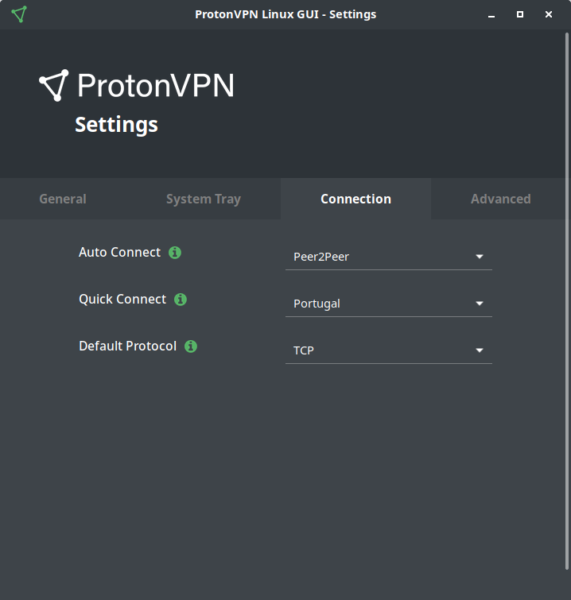
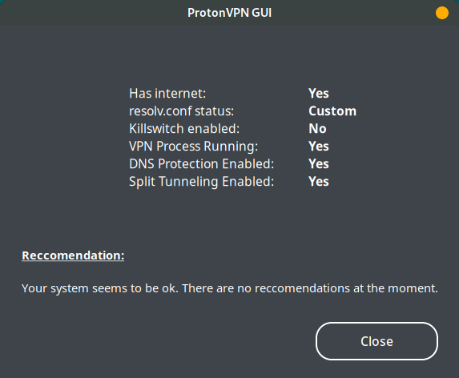

<h1 align="center">ProtonVPN Linux GUI</h1>
<p align="center">
  </img>
</p>

<p align="center">
  <a href="https://github.com/ProtonVPN/protonvpn-gui/releases/latest">
      
  </a>
  <a href="https://pepy.tech/project/protonvpn-gui">
    
  </a>   
    <a href="https://pepy.tech/project/protonvpn-gui/week">
      
    </a>
</p>
<p align="center">
  
</p>
<p align="center">
    <a href="https://actions-badge.atrox.dev/ProtonVPN/protonvpn-gui/goto?ref=master">
        
    </a>
</p>
<p align="center">
  <a href="https://github.com/ProtonVPN/linux-gui/blob/master/LICENSE">
    </img>
  </a>
</p>


<h3 align="center">Linux GUI for ProtonVPN, written in Python. Layout designed in Glade.</h3>
<h3 align="center">Development Status: Beta</h3>

The linux-gui works on top of <a href="https://github.com/ProtonVPN/linux-cli"><b>linux-cli</b></a>, making it a dependency. All local configurations are managed by the GUI (such as updating protocol, split tunneling, manage killswitch) while the connections are managed by the CLI. This way, you will be able to use the latest version of the CLI, while also being able to use the GUI.

## Table of Contents
- [Installing and Updating](#installing-and-updating)
  - [Dependencies](#dependencies)
    - [Python dependencies](#python-dependencies)
    - [ProtonVPN GUI dependencies](#protonvpn-gui-dependencies)
      - [Known Issues](#gui-known-issues)   
        - [Wayland](#wayland)  
    - [ProtonVPN Tray dependencies](#protonvpn-tray-dependencies)
      - [Known Issues](#tray-known-issues)
        - [dbus-launch](#dbus-launch)
  - [Installing ProtonVPN GUI](#installing-protonvpn-linux-gui)
    - [Distribution based](#distribution-based)
    - [PIP based](#pip-based)
      - [How to Update](#to-update-to-a-new-version) 
  - [Manual installation](#manual-installation)
  - [Virtual environment](#virtual-environment)
- [How to use](#how-to-use)
   - [ProtonVPN GUI](#protonvpn-gui)
   - [ProtonVPN Tray](#protonvpn-tray)
- [Enhancements](#enhancements)
  - [Create .desktop file](#create-desktop-file)
    - [ProtonVPN GUI](#protonvpn-gui-1)
    - [ProtonVPN Tray](#protonvpn-tray-1)
  - [Sudo/PolKit](#sudopolkit)
- [GUI Layout](#gui-layout)

# Installing and Updating

### Dependencies

#### Python dependencies
- python >= 3.5
- requests >= 2.23.0
- configparse >= 4.0.2
- pip for python3 (pip3)
- <a href="https://github.com/ProtonVPN/linux-cli"><b>linux-cli</b></a> >= 2.2.2
- setuptools for python3 (python3-setuptools)

#### ProtonVPN GUI dependencies

| **Distro**                              | **Command**                                                                                                     |
|:----------------------------------------|:----------------------------------------------------------------------------------------------------------------|
|Fedora/CentOS/RHEL                       | `sudo dnf install -y python3-gobject gtk3`                                                                      |
|Ubuntu/Linux Mint/Debian and derivatives | `sudo apt install -y python3-gi python3-gi-cairo gir1.2-gtk-3.0`                                                |
|OpenSUSE/SLES                            | `sudo zypper install python3-gobject python3-gobject-Gdk typelib-1_0-Gtk-3_0 libgtk-3-0`                        |
|Arch Linux/Manjaro                       | `sudo pacman -S python-gobject gtk3`                                                                            |

### GUI Known issues:

#### Wayland
While this works well on X11, there are certain restrictions on Wayland since it does not allow GUIs to be launched as root. The way the GUI works at the moment is that it accesses much of the content that the CLI protects with sudo, thus starting with sudo lowers the UX friction, though this is subject to change. More info [here](https://wiki.archlinux.org/index.php/Running_GUI_applications_as_root#Using_xhost) and [here](https://beamtic.com/sudo-and-guis).

Workaround is provied:
1. Install `xhost` or `x11-xserver-utils`
2. Type in terminal `xhost si:localuser:root`
3. Type in terminal `sudo protonvpn-gui`

#### ProtonVPN Tray dependencies

| **Distro**                              | **Command**                                                                                                     |
|:----------------------------------------|:----------------------------------------------------------------------------------------------------------------|
|Fedora/CentOS/RHEL                       | `sudo dnf install -y libappindicator-gtk3 libnotify`                                                                      |
|Ubuntu/Linux Mint/Debian and derivatives | `sudo apt install -y gir1.2-appindicator3 libnotify-bin`                                                                       |
|OpenSUSE/SLES                            | `sudo zypper install libappindicator-gtk3 libnotify`                                                                      |
|Arch Linux/Manjaro                       | `sudo pacman -S libappindicator-gtk3 libnotify`                                                                           |

**NOTE:**
Gnome users will to install and additional extension for this to work: <a href="https://extensions.gnome.org/extension/615/appindicator-support/"> KStatusNotifierItem/AppIndicator Support</a>

### Tray Known issues:
#### dbus-launch
There is a known issue when user attempts to start the systray/appindicator. This might throw an error that is simillar to this one: `(<app-name>:<pid>) LIBDBUSMENU-GLIB-WARNING **: Unable to get session bus: Failed to execute child process "dbus-launch" (No such file or directory)` if a user does not have a specific package installed. If you are unable to use the systray/appindicator and have a simillar error then a solution is provided below.

**Solution:**
Install `dbus-x11` package for your distribution, more information can be found on this <a href="https://askubuntu.com/questions/1005623/libdbusmenu-glib-warning-unable-to-get-session-bus-failed-to-execute-child">stackoverflow</a> post.

#### PolKit (Optional) 
If you would like to use `pkexec` instead of `sudo` (unsure ? [Look here](#sudopolkit)) then you will also need to install the following packages:

| **Distro**                              | **Command**                                                                                                     |
|:----------------------------------------|:----------------------------------------------------------------------------------------------------------------|
|Fedora/CentOS/RHEL                       | `sudo dnf install -y polkit`                                                                      |
|Ubuntu/Linux Mint/Debian and derivatives | `sudo apt install -y libpolkit-agent-1-0`                                                                       |
|OpenSUSE/SLES                            | `sudo zypper install polkit`                                                                      |
|Arch Linux/Manjaro                       | `sudo pacman -S polkit`   

## Installing ProtonVPN Linux GUI

### Distribution based
- Fedora/CentOS/RHEL: To-do
- Ubuntu derivatives: To-do
- OpenSUSE/SLES: To-do
- Arch Linux/Manjaro: <a href="https://aur.archlinux.org/packages/protonvpn-linux-gui/" target="_blank">Available at AUR</a>


### PIP based

*Note: Make sure to run pip with sudo*

`sudo pip3 install protonvpn-gui`

#### To update to a new version

`sudo pip3 install protonvpn-gui --upgrade`

### Manual Installation

1. Clone this repository

    `git clone https://github.com/ProtonVPN/linux-gui`

2. Step into the directory

   `cd linux-gui`

3. Install

    `sudo python3 setup.py install`

### Virtual environment

If you would like to run the the GUI within a virtual environment (for either development purposes or other), then you can easily do that with the help of <a href="https://pipenv.readthedocs.io/en/latest/">pipenv</a>. Make sure to install pipenv beforehand following the next steps.

1. `git clone https://github.com/ProtonVPN/linux-gui` 
2. `cd linux-gui`
3. `pipenv install` installs the virtual environment and all necessary dependencies from `Pipfile`.
4. `pipenv shell` enters the virtual environment.
5. `sudo pip install -e .` installs the GUI in your virtual environment. 
6. `sudo protonvpn-gui` starts the GUI from within the virtual environment.

# How to use

### ProtonVPN GUI

 `sudo protonvpn-gui`

### ProtonVPN Tray

 `protonvpn-tray`

# Enhancements

### Create .desktop file

#### ProtonVPN GUI
To create at <i>desktop</i> launcher with a .desktop file, follow the instructions below.

1. Find the path to the package with `pip3 show protonvpn-gui`

   You should get something like `Location: /usr/local/lib/<YOUR_PYTHON_VERSION>/dist-packages` , this is where your Python packages reside. **Note:** Based on your distro, your `Location` path may not look exactly like this one, so make sure to use your own and `Location` path.

2. Based on previous information, the path to your icon should be `<PATH_DISPLAYED_IN_STEP_1>/protonvpn_linux_gui/resources/img/logo/protonvpn_logo.png`

3. Create a `protonvpn-gui.desktop` file in `.local/share/applications/`, and paste in the following code. Remember to change the **`Icon`** path to your own path.

    ```
    [Desktop Entry]
    Name=ProtonVPN
    GenericName=ProtonVPN GUI for Linux
    Exec=sudo protonvpn-gui
    Icon=<YOUR_ICON_PATH>
    Type=Application
    Terminal=False
    Categories=Utility;GUI;Network;VPN
    ```

#### ProtonVPN Tray
To create at <i>tray icon</i> launcher with a .desktop file, follow the instructions below.

1. Find the path to the package with `pip3 show protonvpn-gui`

   You should get something like `Location: /usr/local/lib/<YOUR_PYTHON_VERSION>/dist-packages` , this is where your Python packages reside. **Note:** Based on your distro, your `Location` path may not look exactly like this one, so make sure to use your own and `Location` path.

2. Based on previous information, the path to your icon should be `<PATH_DISPLAYED_IN_STEP_1>/protonvpn_linux_gui/resources/img/logo/protonvpn_logo.png`

3. Create a `protonvpn-tray.desktop` file in `.local/share/applications/`, and paste in the following code. Remember to change the **`Icon`** path to your own path.

    ```
    [Desktop Entry]
    Name=ProtonVPN Tray
    GenericName=ProtonVPN Tray for Linux
    Exec=protonvpn-tray
    Icon=<YOUR_ICON_PATH>
    Type=Application
    Terminal=False
    Categories=Utility;GUI;Network;VPN
    ```

## Sudo/PolKit
At the moment, since the CLI protects certain files using sudo and also manages killswitch and split tunneling, the GUI will also needs to have access to these sudo protected files, thus, as it is for the moment the GUI needs to have certain root access. This though is subject to change. 
Nonetheless, if you would like to launch the GUI without having to type in your sudo password everytime, then you could add the executable file to `visudo`. This is extremly useful when you have a .desktop file, and all you want to do is click the launcher to have the GUI pop-up.<br>
Another alternative is to launch the GUI with `pkexec`. What this does is that it displays a window for you to type the sudo password, this way, you won't have to use the terminal to type in the password. **Note:** This feature needs to be enabled from within the GUI settings for it to be able to work. If you have not installed the necessary packages then this feature will not be able to be activated.

### Visudo
The instructions for seting up visudo are described below.

1. First you will need the path to the GUI. This can be found by typing `which protonvpn-gui`. You should get something like this: `/usr/bin/protonvpn-gui`. Save it since you will need it later. **Note:** As previously mentioned, the path may look different for you, based on your distro.
2. Identify your username by typing `whoami`. Save it (or memorize it). 
3. In another terminal, type in `sudo visudo`, and a window should pop-up, scroll to the very bottom of it.
4. Once you are at the botton, type: `<YOUR_USERNAME_FROM_STEP2> ALL = (root) NOPASSWD: <YOUR_PATH_FROM_STEP1>`
5. Exit and save! Have fun :)

# GUI Layout
<p align="center">
  </img>
</p>
<p align="center">
  </img>
</p>

<p align="center">
  </img>
</p>
<p align="center">
  </img>
</p> 
<p align="center">
  </img>
</p>  
<p align="center">
  </img>
</p> 

<p align="center">
  </img>
</p> 
 
